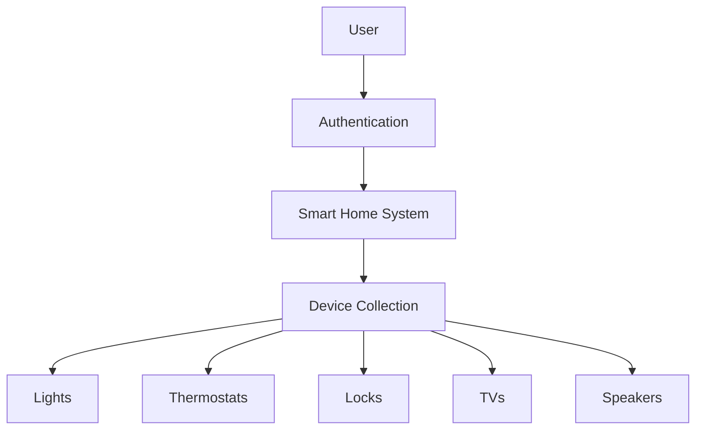

# CBTis47 Smart Home System

<div align="center">

#  Smart Home Device Logger

### MongoDB-based Smart Home Management System


</div>

---

##  Table of Contents

* [📖 Project Description](#-project-description)
* [🎯 Project Goal](#-project-goal)
* [✨ Features](#-features)
* [🛠️ Technologies Used](#️-technologies-used)
* [🚀 Getting Started](#-getting-started)
* [📂 Project Structure](#-project-structure)
* [⚙️ Usage](#️-usage)
* [🏗️ Architecture](#️-architecture)
* [👥 Roles](#-roles)
* [🧪 Testing](#-testing)
* [📈 Future Improvements](#-future-improvements)
* [🤝 Contributing](#-contributing)
* [📜 License](#-license)
* [👨‍💻 Authors](#-authors)
* [📝 Work Log](#-work-log)

---

##  Project Description

This project consists of the design and implementation of a Smart Home system using MongoDB as the main database. The system is focused on managing different types of smart devices within a home environment, allowing centralized control and monitoring.

The platform includes three main user interaction screens:

1. **User Registration Screen**
   Allows new users to create an account by providing essential information such as email and password. This data is stored and validated to ensure unique user identification.

2. **User Access / Authentication Screen**
   Enables registered users to log into the system and access their smart home environment securely.

3. **Device Registration and Management Screen**
   Allows users to register, configure, and manage smart devices within the home. Each device is stored in the database with its general attributes (such as type, brand, status, and location) and its specific configuration depending on the device type.

The system supports multiple device categories, including lights, thermostats, locks, televisions, air conditioners, computers, and speakers. Each device type contains specialized attributes that extend from a central device model.

Additionally, the system incorporates security features for smart locks, including encrypted access codes and rotation tracking.

The database design follows a structured approach where a main device entity is extended by specific device types, enabling scalability and flexibility for future device integrations.

---

##  Project Goal

The goal of this project is to design a flexible and scalable data model capable of representing multiple types of electronic devices within a smart home, including hybrid devices that can perform more than one function.

---

##  Features

- User registration and authentication
  
- Smart device registration and management
  
- Multiple smart device categories
- Flexible MongoDB document modeling
- Scalable NoSQL architecture
- Device-specific configurations
- Smart lock security system
- JSON-based data structures
- MongoDB Atlas compatibility

---

##  Technologies Used

| Technology      | Purpose                |
| --------------- | ---------------------- |
| MongoDB         | Main database          |
| MongoDB Atlas   | Cloud database hosting |
| MongoDB Compass | Database visualization |
| JSON            | Document structure     |
| Mermaid.js      | Diagrams and modeling  |
| Git             | Version control        |
| GitHub          | Repository hosting     |

---

##  Getting Started

### Prerequisites

Before running the project, make sure you have:

* MongoDB Atlas account
* MongoDB Compass installed
* Git installed
* Basic MongoDB knowledge

---

### Installation

Clone the repository:

```bash
git clone https://github.com/your-username/your-repository.git
```

Navigate into the project directory:

```bash
cd your-repository
```

Import the JSON files into MongoDB Compass or Atlas.

---

##  Project Structure

```plaintext
/project-root
│
├── README.md
├── WORKLOG.md
├── /json
│   ├── devices.json
│   ├── lights.json
│   ├── thermostats.json
│   ├── locks.json
│   ├── televisions.json
│   ├── speakers.json
│   └── air_conditioners.json
│
├── /diagrams
│   └── smart_home_model.mmd
│
└── /docs
    └── project_documentation.md
```

---

##  Usage

The project can be used to:

* Store smart home device information
* Simulate device management systems
* Test MongoDB document structures
* Practice NoSQL database modeling
* Develop scalable smart home solutions

### Example Device Document

```json
{
  "device_name": "Living Room Light",
  "type": "Light",
  "brand": "Philips",
  "status": "ON",
  "brightness": 80,
  "location": "Living Room"
}
```

---

##  Architecture

The project follows a **Document-Oriented NoSQL Architecture**.



### Design Approach

* Centralized device collection
* Flexible document inheritance
* Embedded document structures
* Scalable schema design
* Hybrid device compatibility

---

##  Roles

| ROL | NOMBRE TÉCNICO             | RESPONSABLE (Nombre)            | RESPONSABILIDAD PRINCIPAL (Sprints Semanales)                                                                                                                  |
| --- | -------------------------- | ------------------------------- | -------------------------------------------------------------------------------------------------------------------------------------------------------------- |
| 0   | Scrum Master               | Garcia Pulido Samantha Michelle | **Facilitador del proceso.** Asegura que el equipo siga Scrum, elimina impedimentos, mejora la comunicación y protege el Sprint de interrupciones externas.    |
| 1   | The Data Modeler           | Ramírez López Fatima Yocelin    | **Arquitecto JSON.** Define la estructura del documento. Decide qué datos se "embeben" (embed) y cuáles se referencian. Escribe el diagrama en Mermaid.js.     |
| 2   | The Query Developer        | Montalvo Cano Jacqueline        | **Constructor MQL.** Traduce las preguntas de negocio ("¿Cuántos usuarios...?") a código MongoDB (`db.collection.find(...)`). Optimiza filtros y consultas.    |
| 3   | The Integration Specialist | De La Cuz Zayas Juan Irving     | **Configurador del Entorno.** Crea el Cluster en Atlas o la conexión en Compass. Gestiona índices y asegura la conectividad. Administra el repositorio GitHub. |
| 4   | The Data Seeder / QA       | Carrera Quezada Axel Ivan       | **Generador de Caos.** Crea datos de prueba (JSON ficticio). Valida consultas y reporta errores ("bugs").                                                      |

---

##  Testing

Currently, the project focuses on data modeling and database architecture.

Future testing plans include:

* MongoDB query validation
* JSON schema validation
* Device integration tests
* Authentication testing
* CRUD operation testing

---

## Future Improvements

- Real-time device synchronization
- Mobile application integration
- AI-powered automation
-IoT sensor support
- Voice assistant compatibility
- Dashboard analytics
- Role-based authentication
- Energy consumption monitoring

---

##  Contributing

1. Fork the repository
2. Create a feature branch
3. Commit your changes
4. Push your branch
5. Open a Pull Request

---

##  License

This project is intended for educational purposes only.

---

## Authors

### Development Team

* Garcia Pulido Samantha Michelle
* Ramírez López Fatima Yocelin
* Montalvo Cano Jacqueline
* De La Cuz Zayas Juan Irving
* Carrera Quezada Axel Ivan

---

##  Work Log

Consulta el trabajo detallado del equipo aquí:

[WORKLOG.md](./WORKLOG.md)

---

<div align="center">

### ⭐ Smart Home Device Logger ⭐

MongoDB • NoSQL • Smart Devices • JSON Modeling

</div>
