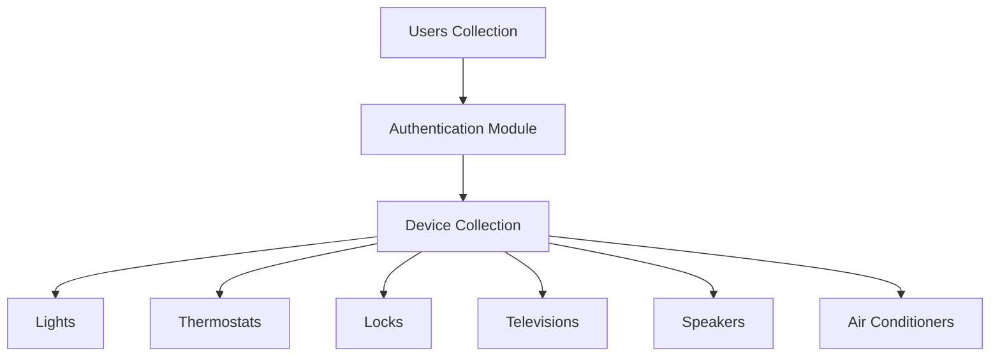

<div align="center">

# CBTis47 Smart Home Management System

### MongoDB-Based Smart Home Infrastructure

<p align="center">
  
</p>


</div>

---

# Table of Contents

- [Project Description](#project-description)
- [System Overview](#system-overview)
- [Project Goals](#project-goals)
- [Features](#features)
- [Technologies Used](#technologies-used)
- [Why MongoDB?](#why-mongodb)
- [Data Modeling](#data-modeling)
- [Architecture](#architecture)
- [Database Collections](#database-collections)
- [Sample Queries](#sample-queries)
- [Project Structure](#project-structure)
- [Installation](#installation)
- [Security Considerations](#security-considerations)
- [Team Contributions](#team-contributions)
- [Future Improvements](#future-improvements)
- [License](#license)
- [Authors](#authors)

---

# Project Description

The CBTis47 Smart Home Management System is a MongoDB-based platform designed to centralize the administration and monitoring of smart home devices inside a connected environment.

The system supports multiple smart device categories while maintaining flexible and scalable document structures using MongoDB and BSON modeling principles.

The project focuses on:

- Smart device registration
- User authentication
- Device monitoring
- Flexible NoSQL schemas
- Smart lock security modeling
- Hybrid device compatibility

---

# System Overview

The platform was designed using a document-oriented architecture where every smart device can store both shared and device-specific attributes.

This approach allows the system to support:

- Lights
- Thermostats
- Locks
- Speakers
- Televisions
- Air conditioners
- Future IoT integrations

without requiring rigid relational schemas.

---

# Project Goals

The main goal of this project is to design a scalable and flexible NoSQL infrastructure capable of representing heterogeneous smart devices within a unified smart home ecosystem.

Additional goals include:

- Practicing BSON document modeling
- Understanding embedded documents
- Applying MongoDB architecture principles
- Simulating real-world IoT systems

---

# Features

- User registration system
- Authentication system
- Smart device management
- Flexible BSON documents
- Device-specific configurations
- Scalable MongoDB architecture
- Embedded JSON structures
- Smart lock security support
- MongoDB Atlas integration

---

# Technologies Used

| Technology | Purpose |
|---|---|
| MongoDB | Main database |
| MongoDB Atlas | Cloud hosting |
| MongoDB Compass | Database visualization |
| JSON | Data representation |
| BSON | MongoDB document format |
| Mermaid.js | Architecture diagrams |
| GitHub | Repository hosting |
| Git | Version control |

---

# Why MongoDB?

MongoDB was selected because smart home systems contain highly dynamic and heterogeneous devices.

Each device category requires different attributes and configurations, making traditional rigid schemas less efficient for scalability.

MongoDB provides:

- Flexible document structures
- Embedded documents
- Dynamic attributes
- High scalability
- Efficient JSON-like modeling
- Hybrid device compatibility

---

# Data Modeling

The project uses a centralized device collection combined with flexible embedded configurations.

## Example BSON Document

```json
{
  "_id": ObjectId(),
  "device_name": "Living Room TV",
  "device_type": "Television",
  "brand": "Samsung",
  "status": "ON",

  "location": {
    "room": "Living Room",
    "floor": 1
  },

  "configuration": {
    "resolution": "4K",
    "volume": 30,
    "wifi_enabled": true
  },

  "created_at": ISODate(),
  "updated_at": ISODate()
}
```

## Design Decisions

The project uses embedded documents because:

- They reduce query complexity
- Improve device organization
- Support polymorphic structures
- Simplify scalability
- Allow flexible configurations

---

# Architecture



---

# Database Collections

| Collection | Description |
|---|---|
| users | Stores user credentials |
| devices | Central smart device registry |
| lights | Smart lighting devices |
| thermostats | Temperature devices |
| locks | Security devices |
| televisions | Multimedia devices |
| speakers | Audio devices |

---

# Sample Queries

## Find active devices

```javascript
db.devices.find({
  status: "ON"
})
```

## Find locked smart locks

```javascript
db.devices.find({
  device_type: "Lock",
  "security.is_locked": true
})
```

## Count devices by category

```javascript
db.devices.aggregate([
  {
    $group: {
      _id: "$device_type",
      total: { $sum: 1 }
    }
  }
])
```

---

# Project Structure

```plaintext
CBTis47-SmartHome/
│
├── README.md
├── WORKLOG.md
├── LICENSE
├── .gitignore
│
├── docs/
│   ├── screenshots/
│   ├── diagrams/
│   └── documentation/
│
├── database/
│   ├── collections/
│   ├── schemas/
│   └── seeders/
│
├── json/
│   ├── users.json
│   ├── devices.json
│   ├── locks.json
│   └── thermostats.json
│
└── diagrams/
    └── smart_home_model.mmd
```

---

# Installation

## Prerequisites

Before running the project, install:

- MongoDB Compass
- Git
- MongoDB Atlas account

## Clone Repository

```bash
git clone https://github.com/your-repository.git
```

## Navigate into Project

```bash
cd CBTis47-SmartHome
```

## Import JSON Collections

Import all JSON files into MongoDB Compass or MongoDB Atlas.

---

# MongoDB Compass Preview

<p align="center">
  
</p>

---

# Security Considerations

The system implements several security-oriented modeling practices:

- Authentication-based access
- Smart lock protection
- Encrypted access code modeling
- Secure Atlas connectivity
- Structured ownership validation

---

# Team Contributions

| Team Member | Contribution |
|---|---|
| Samantha Michelle | Scrum coordination and sprint management |
| Fatima Yocelin | BSON modeling and Mermaid architecture |
| Jacqueline | MongoDB queries and aggregation |
| Juan Irving | Atlas integration and repository management |
| Axel Ivan | JSON test data generation and QA |

---


# License

This project was developed for educational purposes.

---

# Authors

- Garcia Pulido Samantha Michelle
- Ramírez López Fatima Yocelin
- Montalvo Cano Jacqueline
- De La Cruz Zayas Juan Irving
- Carrera Quezada Axel Ivan

---

<div align="center">

MongoDB • BSON • Smart Home • NoSQL Architecture

</div>
